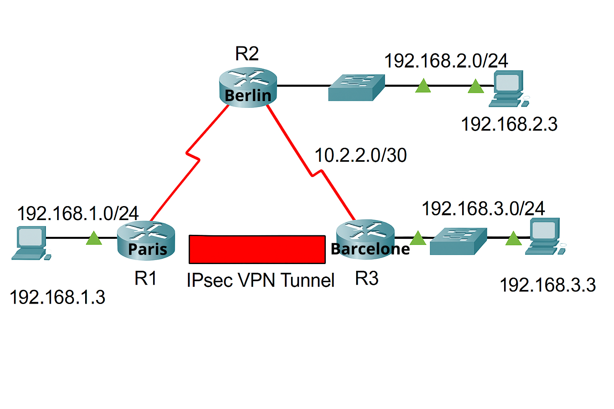

# Site-to-Site IPsec VPN – Paris ↔ Berlin ↔ Barcelone

### Contexte
Une entreprise internationale reliant trois villes :
- **Site A – Paris** (siège)
- **Site B – Berlin** (pass-through)
- **Site C – Barcelone** (filiale)

Objectif : établir un **tunnel IPsec** entre Paris (R1) et Barcelone (R3) via Berlin (R2), qui ne participe pas au chiffrement.

---

##  Prérequis
- Cisco Packet Tracer 
- **Routeurs Cisco** (ex. ISR 1900, 2900, 4300) compatibles IPsec
- **Licence securityk9** activée
- IOS avec support **ISAKMP/IKEv1**, **AES 256**, **SHA-1**, **DH Group 5**
- Câblage et ip plan conformes à la topologie
- Clients PC dans chaque LAN

---

##  Schéma réseau


---

##  Table d’adressage
| Device | Interface | IP Address     | Subnet Mask     | Gateway       |
|--------|-----------|---------------|-----------------|---------------|
| R1     | G0/0      | 192.168.1.1   | 255.255.255.0   | -             |
|        | S0/0/0    | 10.1.1.2      | 255.255.255.252 | -             |
| R2     | S0/0/0    | 10.1.1.1      | 255.255.255.252 | -             |
|        | S0/0/1    | 10.2.2.1      | 255.255.255.252 | -             |
| R3     | G0/0      | 192.168.3.1   | 255.255.255.0   | -             |
|        | S0/0/1    | 10.2.2.2      | 255.255.255.252 | -             |
| PC-A   | NIC       | 192.168.1.3   | 255.255.255.0   | 192.168.1.1   |
| PC-B   | NIC       | 192.168.2.3   | 255.255.255.0   | 192.168.2.1   |
| PC-C   | NIC       | 192.168.3.3   | 255.255.255.0   | 192.168.3.1   |
------------------------------------------------------------------------

##  Étapes de configuration (R1 & R3)

### Activer la licence
```bash
license boot module c1900 technology-package securityk9
reload
```

### Définir le trafic intéressant

**R1 :**

```bash
access-list 110 permit ip 192.168.1.0 0.0.0.255 192.168.3.0 0.0.0.255
```

**R3 :**

```bash
access-list 110 permit ip 192.168.3.0 0.0.0.255 192.168.1.0 0.0.0.255
```

### Configurer ISAKMP – Phase 1

```bash
crypto isakmp policy 10
 encryption aes 256
 authentication pre-share
 group 5
 hash sha
 lifetime 86400
exit
crypto isakmp key vpnpa55 address <peer_ip>
```

### Configurer IPsec – Phase 2

```bash
crypto ipsec transform-set VPN-SET esp-aes esp-sha-hmac
crypto map VPN-MAP 10 ipsec-isakmp
 description VPN connection
 set peer <peer_ip>
 set transform-set VPN-SET
 match address 110
```

### Appliquer la crypto map à l'interface WAN

```bash
interface s0/0/x
 crypto map VPN-MAP
```

----------

##  Vérification

-   **Avant trafic intéressant** : `show crypto ipsec sa` ➡ compteurs à 0
-   **Ping PC-C depuis PC-A**
-   **Après trafic intéressant** : `show crypto ipsec sa` ➡ compteurs augmentent
----------

##  Configs des trois routeurs

Voir `configs/` :

-   `R1_config.txt` – Config complète R1 (Paris)
-   `R2_config.txt` – Config de transit R2 (Berlin)
-   `R3_config.txt` – Config complète R3 (Barcelone)

```
----------
